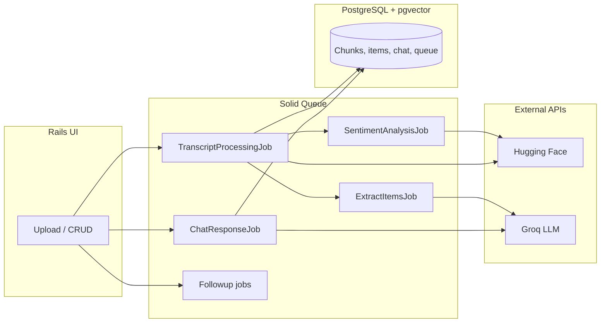

# Meeting Intelligence Hub — Solution Design & Approach

**Purpose:** Brief description of architecture, technology choices, and follow-on work.  
**Audience:** Reviewers, teammates, or future maintainers.

---

## 1. Problem & product shape

Teams lose time scanning long transcripts for decisions, actions, and nuance. This app turns **projects → meetings → transcripts** into structured artifacts: proposed **actions/decisions**, **semantic search** over chunks, **meeting- and project-scoped chat**, **sentiment** views, and **follow-up drafts** (email plus optional integrations) with human review before send.

---

## 2. High-level architecture

1. **Web layer:** Rails 8, server-rendered UI with Hotwire (Turbo + Stimulus) and Tailwind. Session-based auth; resources nested under projects for isolation.
2. **Ingestion:** Transcripts upload via Active Storage; `TranscriptProcessingJob` parses (plain text / VTT-style), chunks content, and calls an embedding API per chunk. Chunks and vectors live in PostgreSQL (**pgvector** via the `neighbor` gem).
3. **Parallel AI work:** After embeddings, **extraction** and **sentiment** run in separate Solid Queue jobs. A small **MeetingPipeline** cache contract marks when embed, extract, and sentiment have finished; the meeting then moves to **completed** and the UI is notified (Action Cable).
4. **Chat:** User messages enqueue `ChatResponseJob`; the LLM answers with context from retrieved chunks (RAG-style), with citations stored on messages.
5. **Follow-ups:** Drafts are generated asynchronously; sending goes through `FollowupSendJob` with Postmark (primary), optional Resend fallback, or SMTP — centralized in `OutboundMailConfig`.

---

## 3. Tech stack choices (why these)

| Choice | Rationale |
|--------|-----------|
| **Rails 8 + Hotwire** | Fast iteration, cohesive full-stack model, HTML-first UX without a separate SPA for this scope. |
| **PostgreSQL + pgvector** | One database for relational data and vector similarity; simpler ops than a separate vector DB at current scale. |
| **Solid Queue** | First-party, DB-backed jobs aligned with Rails 8; no extra Redis dependency for this pipeline. |
| **Groq (LLM)** | Low-latency inference for chat and structured extraction. |
| **Hugging Face (embeddings / sentiment)** | Clear separation: local-quality models via API without hosting embedding servers early on. |
| **Rack::Attack** | Basic abuse protection on expensive endpoints. |
| **Postmark + optional Resend** | Reliable transactional email with a defined fallback path. |

---

## 4. Likely bottlenecks

- **Per-chunk embedding calls** in the transcript job: network latency and provider rate limits dominate for large meetings.
- **LLM calls** for extraction, chat, and draft generation: cost, latency, and consistency under load.
- **Single DB** for app + Solid Queue + vectors: contention and index maintenance as data grows.
- **Pipeline coordination via Rails.cache**: works for “all three jobs done,” but is sensitive to cache store configuration in multi-process deployments (should align with production cache).

---

## 5. What would be improve with more time

1. **Embeddings:** Batch embedding API calls, backoff/retry policies, optional async chunk writes, or a dedicated worker pool; consider smaller/faster embedding models where quality allows.
2. **Observability:** Structured logging, OpenTelemetry traces around jobs and external calls, dashboards for queue depth and LLM error rates.
3. **RAG quality:** Hybrid search (keyword + vector), re-ranking, and stricter citation grounding; evaluation set from real transcripts.
4. **Scale-out:** Read replicas or splitting job metadata from analytical queries; revisit vector index tuning (lists / probes) for pgvector at larger corpora.
5. **Product hardening:** Role-based access within projects, audit log for edits/sends, richer integration tests for full pipeline paths.

---